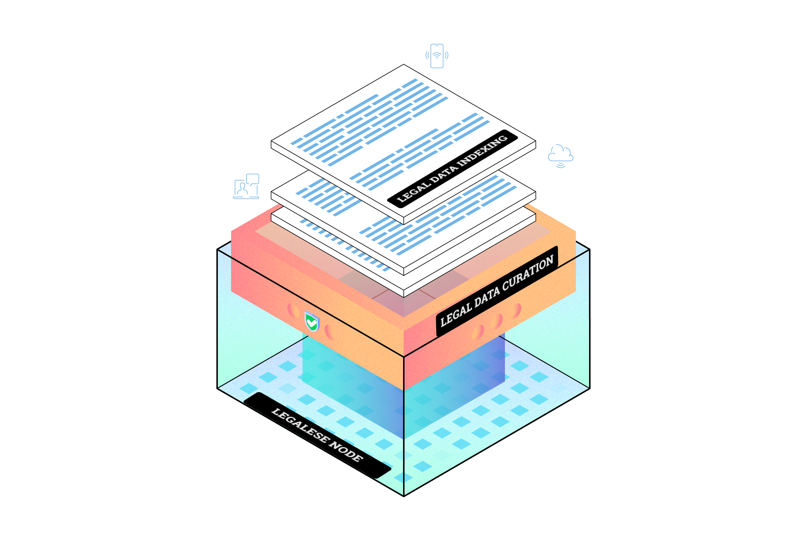

# 🚀 Current Development Priorities

> Building the foundation for decentralized legal intelligence on DataHive's network. Join us in revolutionizing how legal data is processed, validated, and distributed across Web3.

<p align="center">
  
</p>

## 🎯 Primary Focus Areas

1. 📚 Legal Data Indexing and Curation System
2. 🌐 Node Operations
3. ⛓️ Blockchain Integration
4. ⚡ Performance Optimization

## 📚 1. Legal Data Indexing and Curation System

We're building the next generation of legal data processing infrastructure. Our system will transform how legal documents are indexed, processed, and made accessible across the decentralized web.

### 🛠️ Core Focus:
- **Smart Web Scraping** for critical legal documents:
  - Cookie policies
  - Privacy policies
  - Terms of service
  - Legal notices
  - Website compliance documents
- **Future-Proof Architecture** supporting advanced NLP (LN2-LN5)
- **Innovative Data Structures** for Legal Data Dictionary and Taxonomy
- **Intelligent Validation** for compliance verification

### 🎯 Key Tasks:
```python
class LN1Priorities:
    def core_tasks(self):
        return [
            "Build robust web scraping infrastructure",
            "Develop modular architecture for future extensibility",
            "Create flexible storage schemas",
            "Implement basic text processing functionality",
            "Design APIs that support future NLP integration"
        ]
```
## 🌐 2. Node Operations

Node operators are the backbone of our decentralized network. We're creating a robust infrastructure that rewards contribution and ensures network reliability.

### 💪 Node Responsibilities
- Advanced content collection and processing
- Decentralized validation and quality assurance
- Intelligent storage management
- Real-time performance monitoring

### 🤝 Node Coordination
```python
class NodeCoordination:
    features = {
        "distribution": "Dynamic work allocation",
        "communication": "P2P mesh network",
        "resources": "Intelligent resource sharing",
        "quality": "Automated quality control"
    }
```

## ⛓️ 3. Blockchain Integration

Deployed on OP Sepolia through AltLayer's RaaS, we're building a seamless bridge between legal data and blockchain technology.

### 🏗️ Storage Strategy
- **0G Integration**: Primary storage through AIOS
- **OP Sepolia**: Testnet infrastructure via AltLayer
- **Modular Design**: Future-ready for multiple storage solutions
- **Optimized Structure**: Efficient 0G data management

### 🔗 Integration Points
```solidity
contract LN1Integration {
    // Key integration points
    address public constant ALTLAYER_RAAS = address(0x...);
    address public constant ZERO_G_AIOS = address(0x...);
    address public constant OP_SEPOLIA = address(0x...);
}
```

## ⚡ 4. Performance Optimization

Performance is our north star for LN1. We're building for speed, efficiency, and scalability.

### 📊 Performance Metrics
```python
class PerformanceTargets:
    metrics = {
        "scraping_speed": "1000 docs/minute",
        "processing_latency": "<100ms",
        "storage_ops": "<50ms",
        "api_response": "<200ms"
    }
```

## 🌟 Community Development

Join our growing ecosystem of developers building innovative applications:

- 🔍 Browser extensions for legal analysis
- 📊 Research and comparison tools
- 🛡️ Compliance monitoring solutions
- 📈 Risk assessment platforms

## 💫 Future Vision (LN2-LN5)

While LN1 establishes our foundation, the future holds:
- 🧠 Advanced NLP/AI capabilities
- 🔒 Enhanced security features
- 📦 Extended storage solutions
- 🤖 ML-powered analysis

---

<p align="center">
  
</p>

> 🤝 Join us in building the future of legal intelligence! Check out our [Contributing Guidelines](CONTRIBUTING.md) to get started.