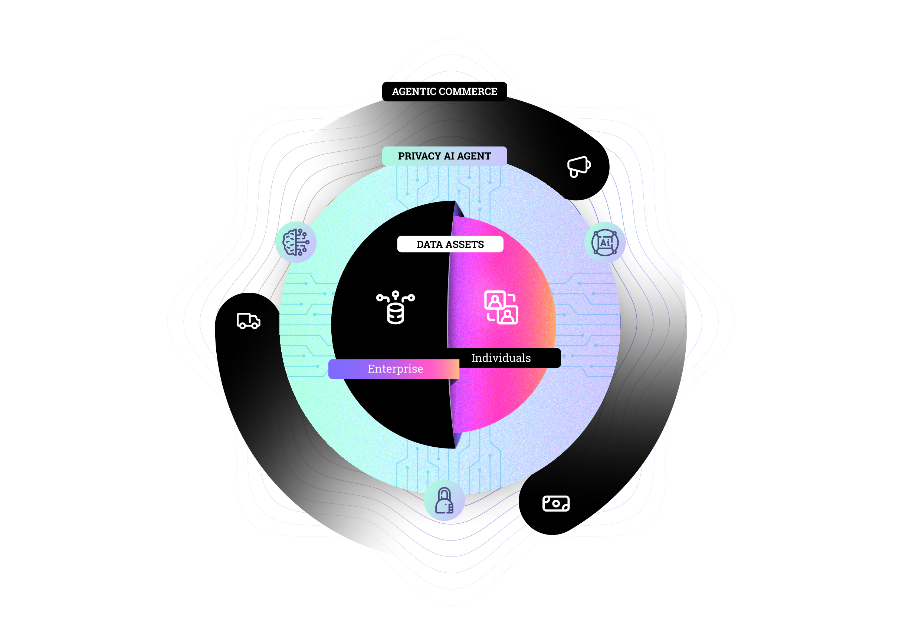

# DataHive's Legal Intelligence Layer

<p align="center">
  
</p>

[](https://opensource.org/licenses/MIT)
[]()
[]()
[](https://twitter.com/getdatahive)
[](https://t.me/datahiveofficial)
[](mailto:team@datahive.network)

## Overview

LN1 Legalese Node is a core component of the DataHive network, providing decentralized legal data indexing, curation, and validation services. It forms the foundation of DataHive's Legal Intelligence Layer, enabling decentralized legal frameworks and transparent data governance across the network.

## 🧠 Key Features

- **Legal Data Knowledge Models**: Collection and processing of legal documents and regulatory frameworks
- **Real-time Processing Pipeline**: Automated indexing and classification using advanced NLP
- **Decentralized Validation**: Multi-node consensus ensuring data accuracy and reliability
- **Privacy-First Architecture**: Zero-knowledge proofs for sensitive legal data processing
- **Cross-Chain Compatibility**: Seamless interaction with multiple blockchain networks

## 🔄 Architecture

### Legal Knowledge Models
- [Precedent Graphs](./docs/models/precedent-graphs.md) - Legal precedent analysis and mapping
- [Regulatory Frameworks](./docs/models/regulatory-frameworks.md) - Compliance and regulatory structure
- [Compliance Patterns](./docs/models/compliance-patterns.md) - Pattern detection and validation

### Data Processing Pipeline
- [Document Indexer](./docs/pipeline/document-indexer.md) - Automated legal document processing
- [Pattern Recognition](./docs/pipeline/pattern-recognition.md) - AI-powered pattern analysis
- [Validation Engine](./docs/pipeline/validation-engine.md) - Multi-node consensus validation

### AI Integration Layer
- [Query Interface](./docs/ai/query-interface.md) - Secure data querying protocol
- [Model Updates](./docs/ai/model-updates.md) - Privacy-preserving model synchronization
- [Privacy Guards](./docs/ai/privacy-guards.md) - Zero-knowledge computation framework

### Interaction with On-Device AI

<p align="center">
  
</p>

Your DataHive AI agent interacts with LN1 nodes to:
- Access validated legal knowledge while maintaining privacy
- Receive real-time updates to legal models
- Contribute to network intelligence through privacy-preserving feedback loops
- Execute compliant smart contracts and legal automation

## 🚀 Development

### Prerequisites
```bash
node >= 16.0.0
npm >= 8.0.0
go >= 1.19
```

### Installation
```bash
git clone https://github.com/datahiv3/Legalese-Node-LN1.git
cd Legalese-Node-LN1
npm install
```

### Configuration
```bash
cp .env.example .env
# Edit configuration settings
```

### Local Development
```bash
npm run dev
```

### Testing
```bash
npm run test
```

### Deployment

#### Mainnet
```bash
npm run deploy:mainnet
```

#### Testnet
```bash
npm run deploy:testnet
```

## 📘 Documentation

- [Technical Architecture](./docs/architecture.md)
- [Legal Model Specification](./docs/legal-models.md)
- [AI Integration Guide](./docs/ai-integration.md)
- [Privacy Framework](./docs/privacy.md)

## [🛣️ Roadmap](https://github.com/orgs/datahiv3/projects/3)

**Phase 1: Core Infrastructure Development**
- Smart Contract Implementation
- Basic Node Operations
- Data Indexing System

**Phase 2: Network Enhancement**
- Multi-Node Validation
- Cross-Chain Integration
- Advanced Privacy Features

**Phase 3: Ecosystem Expansion**
- Global Framework Support
- Advanced AI Capabilities
- Enterprise Integration

## 🤝 Contributing

Join us in building the future of legal intelligence! See our [Contributing Guidelines](./CONTRIBUTING.md) for details.

## 🔒 Security

Security is crucial for legal data. For concerns, email [team@datahive.network](mailto:team@datahive.network).

## 📜 License

This project is licensed under the MIT License - see the [LICENSE](./LICENSE) file for details.
