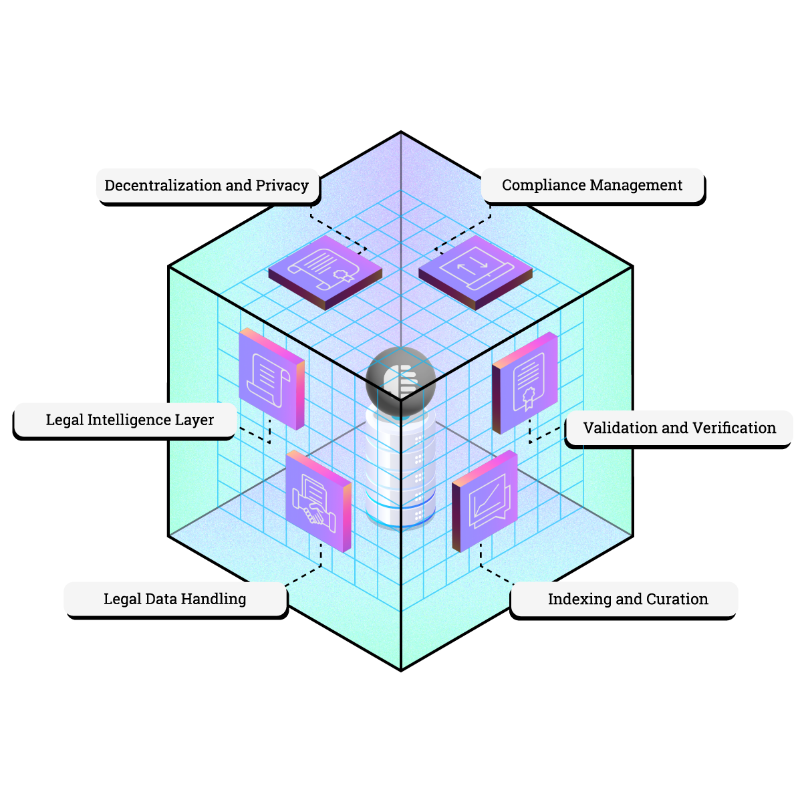

# LN1 Legalese Node: Legal Intelligence Layer for DataHive

<p align="center">
  
</p>

[](https://opensource.org/licenses/MIT)
[]()
[]()
[](https://twitter.com/getdatahive)
[](https://t.me/datahiveofficial)
[](mailto:team@datahive.network)

## Legal Intelligence

LN1 is the cornerstone of DataHive's legal intelligence infrastructure, transforming how legal knowledge is processed, validated, and distributed across the network. By combining advanced data models with decentralized validation, LN1 nodes create a robust foundation for privacy-preserving legal intelligence that works seamlessly with DataHive's on-device AI agents.

## 🧠 Features

- **Dynamic Legal Knowledge Models**: Continuously evolving data models that capture complex legal frameworks and precedents
- **Real-time Legal Data Processing**: Automated indexing and classification of legal documents using advanced NLP
- **Decentralized Validation**: Multi-node consensus ensuring accuracy and reliability of legal intelligence
- **Privacy-First Architecture**: Zero-knowledge proofs for sensitive legal data processing
- **AI-Ready Data Structures**: Optimized for seamless integration with DataHive's on-device AI agents

## 🔄 How It Works

### Legal Intelligence Layer
```python
LN1 Node
├── Legal Knowledge Models
│   ├── Precedent Graphs
│   ├── Regulatory Frameworks
│   └── Compliance Patterns
├── Data Processing Pipeline
│   ├── Document Indexer
│   ├── Pattern Recognition
│   └── Validation Engine
└── AI Integration Layer
    ├── Query Interface
    ├── Model Updates
    └── Privacy Guards
```

### Interaction with On-Device AI
<p align="center">
  
</p>
Your DataHive AI agent interacts with LN1 nodes to:
- Access validated legal knowledge while maintaining privacy
- Receive real-time updates to legal models
- Contribute to network intelligence through privacy-preserving feedback loops
- Execute compliant smart contracts and legal automation

## 🚀 Getting Started

### Prerequisites

```bash
node >= 16.0.0
npm >= 8.0.0
go >= 1.19
```

### Quick Start

```bash
git clone https://github.com/datahiv3/Legalese-Node-LN1.git
cd Legalese-Node-LN1
npm install
```

## 📘 Documentation

- [Technical Architecture](./docs/architecture.md)
- [Legal Model Specification](./docs/legal-models.md)
- [AI Integration Guide](./docs/ai-integration.md)
- [Privacy Framework](./docs/privacy.md)

## [🛣️ Roadmap](https://github.com/orgs/datahiv3/projects/3)

**Phase 1: Core Intelligence**
- Legal knowledge model implementation
- Basic pattern recognition
- Initial AI agent integration

**Phase 2: Advanced Features**
- Complex legal reasoning
- Cross-jurisdictional analysis
- Enhanced privacy features

**Phase 3: Network Scale**
- Global legal framework support
- Advanced AI capabilities
- Enterprise integration

## 🤝 Contributing

Join us in building the future of legal intelligence! See our [Contributing Guidelines](./CONTRIBUTING.md) for details.

## 🔒 Security

Security is crucial for legal data. For concerns, email [team@datahive.network](mailto:team@datahive.network).

## 📜 License

MIT License - see [LICENSE](./LICENSE) for details.

## 🌐 Connect With Us

- [Website](https://datahive.network)
- [Telegram](https://t.me/datahiveofficial)
- [Twitter](https://twitter.com/getdatahive)
- [Email](mailto:team@datahive.network)
