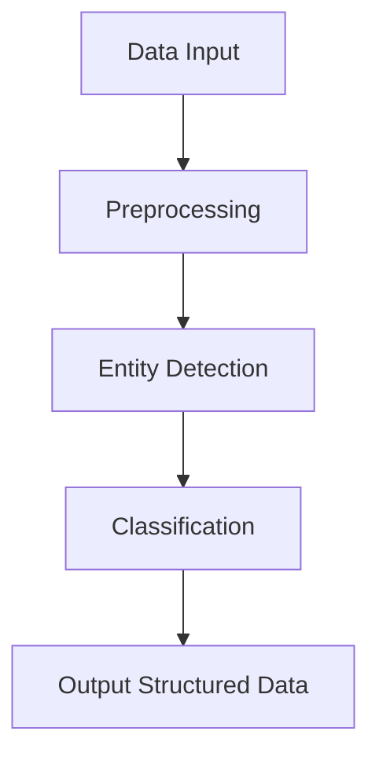

## Entity Recognition

Entity recognition is a crucial component of the DataHive network, enabling the identification and categorization of legal entities and terms within documents. This process enhances the ability to structure and analyze legal data effectively.

### Key Concepts

1. **Entity Types**
   - **Legal Entities**: Identifying organizations, individuals, and governmental bodies.
   - **Terms and Concepts**: Recognizing specific legal terms, statutes, and case references.

2. **Process Flow**

- **Data Input**: Raw legal documents are fed into the system.
- **Preprocessing**: Text is cleaned and prepared for analysis.
- **Entity Detection**: Algorithms identify potential entities within the text.
- **Classification**: Entities are categorized into predefined types.
- **Output Structured Data**: Results are formatted for integration into the knowledge graph.

3. **Tools and Techniques**
   - **Natural Language Processing (NLP)**: Utilizes advanced NLP models to parse and understand complex legal language.
   - **Machine Learning Algorithms**: Employs supervised learning to improve entity recognition accuracy over time.

4. **Integration with Knowledge Graphs**
   - Enhances the dynamic mapping of legal concepts by providing structured data inputs.
   - Supports continuous learning by updating the graph with newly identified entities.

### Benefits

- **Improved Data Structuring**: Facilitates better organization and retrieval of legal information.
- **Enhanced Analysis**: Provides a foundation for more sophisticated analytical capabilities, such as trend forecasting and compliance risk assessment.

