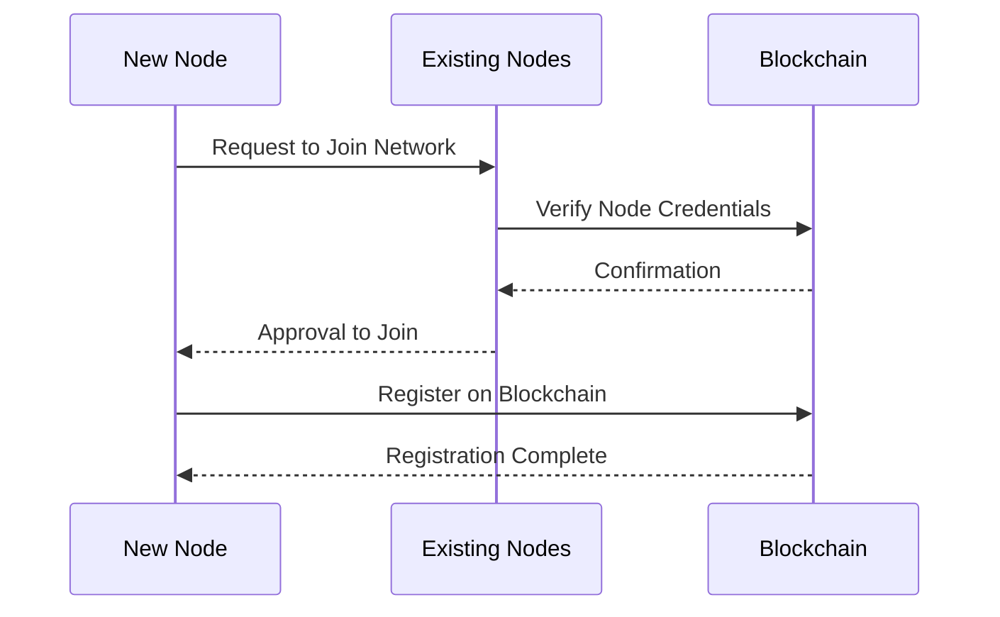

## Node Integration

Node integration within the DataHive network is crucial for ensuring seamless communication, efficient data processing, and robust network functionality. This guide provides developers with all the necessary resources and information to understand and implement node integration.

### Key Components

1. **Communication Protocols**
   - **[Inter-Node Messaging](/docs/infrastructure/inter-node-messaging.md)**: Utilize standardized messaging protocols to facilitate efficient data exchange between nodes.
   - **[Synchronization](/docs/infrastructure/synchronization.md)**: Ensure all nodes are updated with the latest data and network state for consistent operations.

2. **Data Sharing**
   - **[Distributed Ledger](/docs/blockchain/distributed-ledger.md)**: Implement blockchain technology to maintain a secure, immutable record of transactions and data exchanges.
   - **[Data Replication](/docs/infrastructure/data-replication.md)**: Ensure consistency by replicating critical information across nodes.

3. **Task Coordination**
   - **[Load Balancing](/docs/infrastructure/load-balancing.md)**: Distribute tasks evenly to prevent overload and optimize performance.
   - **[Task Scheduling](/docs/smart-contracts/task-scheduling.md)**: Use smart contracts to automate task allocation based on node capacity.

4. **Scalability**
   - **[Dynamic Node Addition](/docs/infrastructure/dynamic-node-addition.md)**: Support seamless addition of new nodes to expand network capacity.
   - **[Resource Management](/docs/infrastructure/resource-management.md)**: Monitor resource usage to optimize performance and scalability.

### Integration Process

- **Request to Join**: New nodes initiate a request to join the network.
- **Verification**: Existing nodes verify credentials using the blockchain.
- **Approval and Registration**: Upon approval, new nodes are registered on the blockchain.

### Tools and Resources

- **API Documentation**: Access detailed API documentation in the `/docs/api` folder for integration specifics.
- **Smart Contracts**: Review smart contract templates in the `/docs/smart-contracts` folder for task automation.
- **Security Guidelines**: Follow security best practices outlined in the `/docs/security` folder.

### Benefits

- **Enhanced Collaboration**: Facilitates efficient collaboration between nodes, improving overall network functionality.
- **Robust Security**: Blockchain integration ensures secure and transparent operations.
- **Improved Efficiency**: Optimized task coordination and load balancing enhance network performance.
