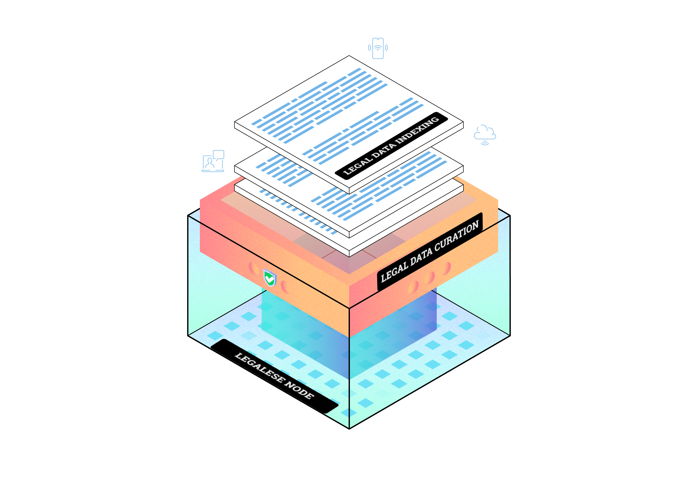
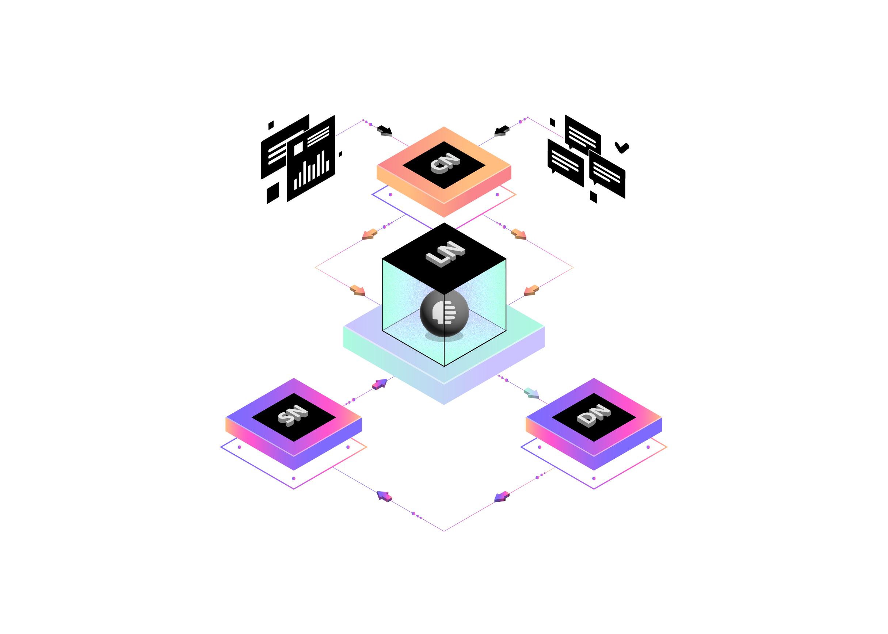
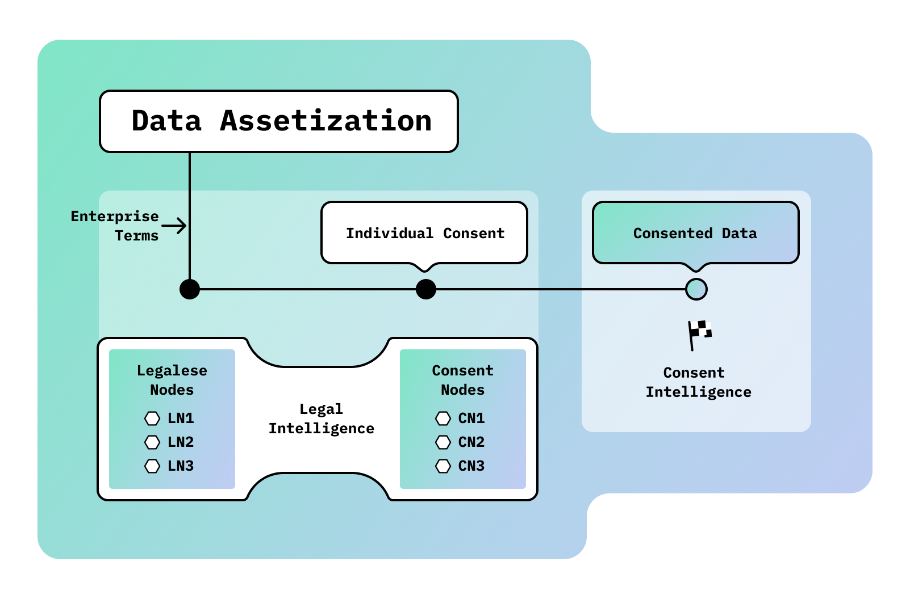
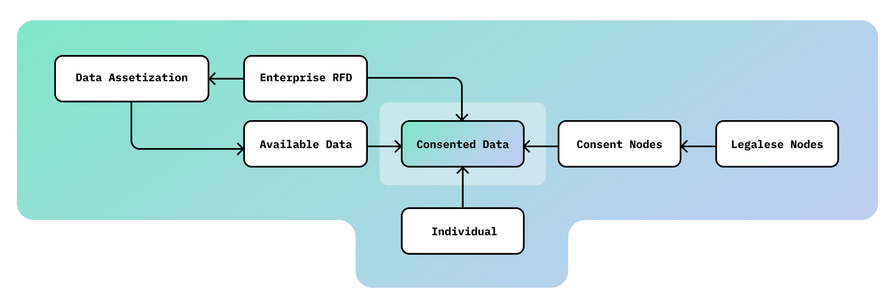
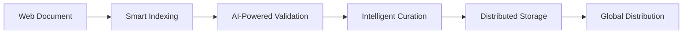
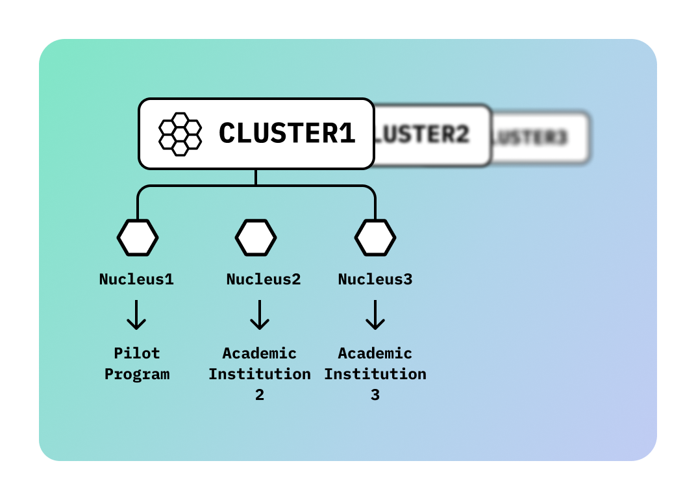

# LN1: Building Our Network's Legal Intelligence


<div align="center">

[](https://twitter.com/GetDataHive)
[](https://t.me/datahiveofficial)
[](https://github.com/datahiv3/Legalese-Node-LN1)

[Documentation](https://docs.datahive.network) |
[Contact](mailto:team@datahive.network) |
[Telegram Community](https://t.me/datahiveofficial)

<p align="center">
  
</p>

*Building the decentralized infrastructure for legal intelligence*
</div>

## Overview

LN1 - a groundbreaking node that's revolutionizing how we process, validate, and manage legal data across the web. Our distributed architecture combines cutting-edge blockchain technology with advanced data processing capabilities to create a powerful legal intelligence network.

## Core Architecture

<p align="center">
  
</p>

The LN1 system employs a sophisticated agent layer architecture that orchestrates multiple specialized components working in harmony. This innovative design enables seamless processing of legal documents from across the web, transforming raw data into valuable legal intelligence.

### Processing Components

LN1's architecture is built around specialized processing nodes that work together to create a robust and efficient system. These components are distinct from DataHive's specialized business nodes (Legalese Node, Consent Node, etc.) and represent the core processing capabilities within each node:

<p align="center">
  
</p>

```typescript
interface ProcessingNodeTypes {
    INDEXER: 'Intelligent web crawling and document processing',
    VALIDATOR: 'Advanced content validation and verification',
    CURATOR: 'Smart document lifecycle management',
    STORAGE: 'Distributed resilient storage system'
}
```

## System Layers
### Data Asset Layer

<p align="center">
  
</p>

At its core, LN1 specializes in processing web-based legal documents:

- **Intelligent Web Crawling**
  - Privacy Policies
  - Terms of Service
  - Cookie Policies
  - User Agreements
  - Legal Notices

```typescript
interface WebDocumentStorage {
    distributed_storage: {
        raw_html: IPFS;        // Preserving original content
        parsed_content: IPFS;   // Structured legal data
    };
    metadata_store: {
        source_url: string;     // Document origin
        last_updated: timestamp;
        document_type: 'privacy_policy' | 'terms' | 'cookie_policy';
        crawl_metadata: CrawlInfo;
    };
    state_store: Ethereum;      // Immutable validation state
    local_cache: Redis;         // High-performance access
}
```

### Processing Layer: The Intelligence

Our processing pipeline transforms raw legal documents into structured, validated intelligence:

```python
class ProcessingPipeline:
    def __init__(self):
        self.indexer = DocumentIndexer()
        self.validator = ContentValidator()
        self.curator = DataCurator()
        
    async def process_document(self, document):
        indexed = await self.indexer.process(document)
        validated = await self.validator.validate(indexed)
        return await self.curator.curate(validated)
```

## Data Flow: The Journey

<p align="center">
  
</p>

Watch as legal documents transform through our system:



## Infrastructure Innovation

### Node Clustering

<p align="center">
  
</p>

Our advanced node clustering system ensures:
- High availability
- Fault tolerance
- Optimal performance
- Global scalability

## Security & Compliance

We've implemented state-of-the-art security measures:

```solidity
contract AccessControl {
    mapping(address => Role) public roles;
    mapping(bytes32 => mapping(Role => bool)) public permissions;
    
    function hasPermission(address user, bytes32 resource) 
        public 
        view 
        returns (bool) 
    {
        return permissions[resource][roles[user]];
    }
}
```

## Horizon

LN1 is continuously evolving with exciting developments on the horizon:

- **AI Integration**: Advanced document analysis and pattern recognition
- **Cross-chain Operations**: Expanded blockchain network support
- **Enhanced Analytics**: Deep insights into legal document trends
- **Global Scale**: Increased processing capacity and reach