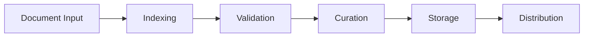

# LN1 Architecture

## System Overview

The LN1 platform implements a distributed architecture for legal document processing and validation, combining blockchain technology with specialized legal data management systems.

## Core Components

### Node Types

```typescript
interface NodeTypes {
    INDEXER: 'Processes and catalogs legal documents',
    VALIDATOR: 'Validates document integrity and content',
    CURATOR: 'Manages document lifecycle and quality',
    STORAGE: 'Handles distributed document storage'
}
```

### Component Interaction

<p align="center">
  
</p>

## System Layers

### Data Layer

- **Document Storage**
  - Distributed file system
  - IPFS integration
  - Redundancy management

- **State Management**
  - Blockchain state
  - Document metadata
  - Validation records

### Processing Layer

```python
class ProcessingPipeline:
    def __init__(self):
        self.indexer = DocumentIndexer()
        self.validator = ContentValidator()
        self.curator = DataCurator()
        
    async def process_document(self, document):
        indexed = await self.indexer.process(document)
        validated = await self.validator.validate(indexed)
        return await self.curator.curate(validated)
```

### Network Layer

- **Node Communication**
  - P2P protocol
  - Message queuing
  - State synchronization

- **Consensus Management**
  - Validation consensus
  - State agreement
  - Conflict resolution

## Infrastructure Components

### Node Clustering

<p align="center">
  
</p>

### Storage Architecture

```typescript
interface StorageLayer {
    distributed_storage: IPFS;
    local_cache: Redis;
    state_store: Ethereum;
    metadata_store: PostgreSQL;
}
```

## Security Architecture

### Access Control

```solidity
contract AccessControl {
    mapping(address => Role) public roles;
    mapping(bytes32 => mapping(Role => bool)) public permissions;
    
    function hasPermission(address user, bytes32 resource) 
        public 
        view 
        returns (bool) 
    {
        return permissions[resource][roles[user]];
    }
}
```

### Encryption Layer

- End-to-end encryption
- At-rest encryption
- Transport security

## Integration Points

### External Systems

- **Blockchain Networks**
  - Ethereum mainnet
  - OP Sepolia
  - Cross-chain bridges

- **Storage Systems**
  - IPFS
  - Arweave
  - Filecoin

### API Layer

```typescript
interface APIEndpoints {
    '/documents': 'Document management endpoints',
    '/validation': 'Validation service endpoints',
    '/nodes': 'Node management endpoints',
    '/metrics': 'System metrics and monitoring'
}
```

## Scalability Design

### Horizontal Scaling

- Dynamic node allocation
- Load balancing
- Sharding strategy

### Vertical Scaling

- Resource optimization
- Performance tuning
- Capacity planning

## Data Flow

<p align="center">
  
</p>

### Processing Pipeline



## Monitoring System

### Performance Metrics

- Transaction throughput
- Node health
- Network latency
- Storage utilization

### Alert System

```python
class MonitoringSystem:
    def monitor_metrics(self):
        return {
            'node_health': self.check_node_health(),
            'network_status': self.check_network_status(),
            'storage_metrics': self.check_storage_metrics()
        }
```

## Deployment Architecture

### Container Structure

```yaml
version: '3.8'
services:
  indexer:
    image: ln1/indexer
    depends_on:
      - storage
      - validator
  
  validator:
    image: ln1/validator
    depends_on:
      - consensus
  
  curator:
    image: ln1/curator
    depends_on:
      - indexer
```

### Network Configuration

- Load balancing
- Service discovery
- Failover handling

## Future Expansion

### Planned Components

- Advanced analytics engine
- Machine learning integration
- Cross-chain interoperability
- Enhanced security features

### Upgrade Path

- Backward compatibility
- Migration strategies
- Version management