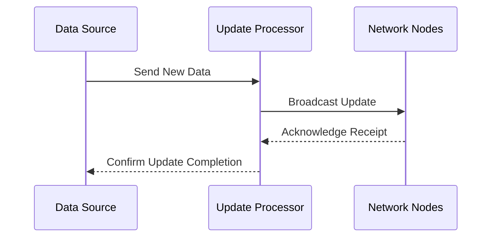

## Real-Time Updates

The real-time updates feature in the DataHive network ensures that all nodes and components are consistently synchronized with the latest data and changes. This capability is crucial for maintaining the accuracy and reliability of the network's legal intelligence services.

### Key Features

1. **Live Data Streaming**
   - **Continuous Data Flow**: Implement a continuous data streaming mechanism to ensure that updates are propagated in real-time across all nodes.
   - **Event-Driven Architecture**: Utilize an event-driven model to trigger updates as soon as new data is available.

2. **Synchronization Protocols**
   - **Distributed Consensus**: Employ consensus algorithms to ensure that all nodes agree on the current state of the network.
   - **Conflict Resolution**: Implement mechanisms to resolve conflicts that may arise from simultaneous updates.

3. **Scalability**
   - **Dynamic Resource Allocation**: Adjust resource allocation dynamically to handle varying loads and ensure smooth operation.
   - **Node Scalability**: Support seamless integration of additional nodes to accommodate growing data volumes.

4. **Security Measures**
   - **Data Integrity Checks**: Use cryptographic techniques to verify the integrity of data being updated across the network.
   - **Access Controls**: Implement strict access controls to manage who can initiate updates and view real-time data.

### Implementation Process

- **Data Source**: Initiates the update by sending new data.
- **Update Processor**: Handles the processing and broadcasting of updates.
- **Network Nodes**: Receive and apply updates, acknowledging receipt.

### Tools and Resources

- **API Endpoints**: Access API documentation in the `/docs/api` folder for details on real-time update integration.
- **Security Guidelines**: Follow best practices outlined in the `/docs/security` folder to secure real-time data flows.

### Benefits

- **Timely Information**: Ensures that all nodes have access to the most current data, enhancing decision-making capabilities.
- **Improved Reliability**: Maintains consistency across the network, reducing errors and discrepancies.
- **Enhanced Performance**: Optimizes resource use through efficient update propagation, improving overall network performance.

